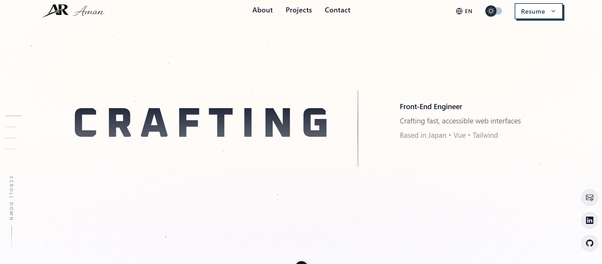
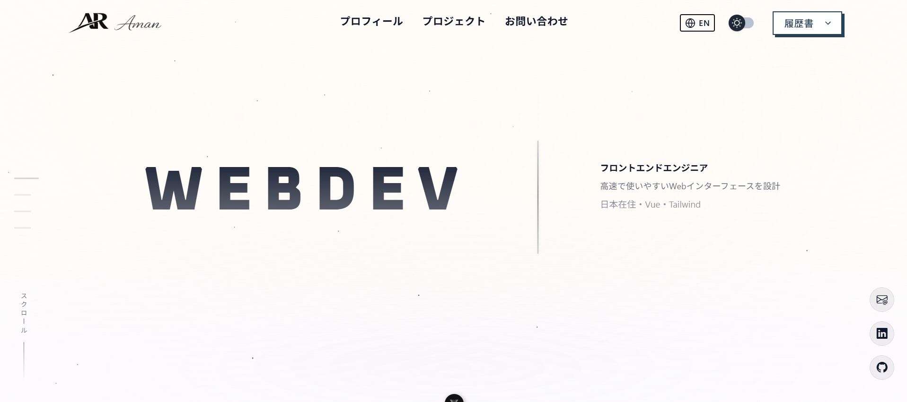
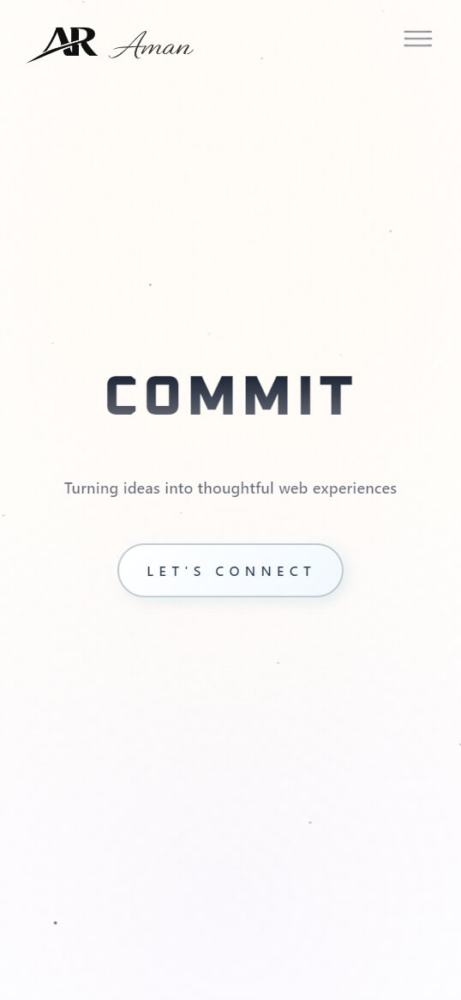

> 🇯🇵 [日本語版はこちら](./README.ja.md)

# Portfolio Website

A personal portfolio site built entirely from scratch to showcase my frontend work. No templates, no themes. Every component, animation, and translation were custom implemented.

> 🔗 **Live:** [obliviousaman.netlify.app](https://obliviousaman.netlify.app/)

---

## Technologies

| Tech | Purpose |
|------|---------|
| Vue 3 (Composition API) | Core framework with `<script setup>` syntax throughout |
| Vite | Build tool and dev server |
| Tailwind CSS | Utility-first styling with custom configuration |
| GSAP + ScrollTrigger | Scroll-based animations and page transitions |
| Vue I18n | Full English ↔ Japanese language switching |
| Lottie | Lightweight motion graphics |
| Netlify | Hosting and deployment |

---

## Features

- **Bilingual (EN/JP)** — full language toggle, not just translated strings. Layout spacing and font sizing adjust per language since Japanese characters need different breathing room
- **Scroll-triggered animations** — each section animates into view using GSAP + ScrollTrigger, lazy-loaded so off-screen sections don't initialize unnecessarily
- **Custom mobile navigation** — hamburger menu with circular expansion animation, not a library dropdown
- **Responsive across devices** — mplemented with mobile/tablet/desktop breakpoints and adaptive layout behavior.
- **Section-based architecture** — each part of the site is its own Vue component, easy to maintain and extend

---

## The Process

1. **Wireframing** — started with rough layouts on paper, figured out what sections I needed and how the scroll flow should feel
2. **Component structure** — broke the site into reusable Vue components early. Each section is self-contained with its own animation logic
3. **Animations first, content second** — since motion was a priority, I built the GSAP scroll triggers before finalizing the copy. This let me tune the timing to feel right instead of forcing animations onto a static layout
4. **Language support** — added Vue I18n after the base structure was solid. Had to revisit spacing and layout decisions because Japanese text behaves differently than English at the same font size
5. **Mobile polish** — spent more time here than expected. The hamburger menu alone went through 3 iterations before the circular expansion felt smooth
6. **Testing and deploy** — tested across Chrome, Safari, Firefox, and mobile browsers. Deployed on Netlify with continuous deployment from GitHub

---

## What I Learned

### Vue 3 Composition API
- How to structure components using `<script setup>` and composables instead of the Options API
- Managing reactive state with `ref` and `reactive` across multiple sections
- Keeping component logic clean when animations and i18n are both involved

### Animation & GSAP
- ScrollTrigger pin and scrub behavior getting smooth scroll-linked animations without janky playback
- Timing and easing curves make or break how a site feels. Small tweaks to `duration` and `ease` had huge impact
- Lazy-loading animation instances so the browser doesn't choke on a page with many animated sections

### Internationalization (i18n)
- Vue I18n setup for switching between English and Japanese at runtime
- Learned that localization isn't just text replacement. Japanese characters are wider, line heights need adjustment, and some layouts that work in English break in Japanese
- Managing translation files and keeping them in sync as the site grew

### CSS & Responsive Design
- Tailwind's utility classes speed things up, but custom config was necessary for my specific color palette and breakpoints
- Mobile-first approach saved me from rewriting media queries later
- Z-index management gets tricky fast when you have overlapping scroll animations and a sticky navbar

### Problem Solving
- Debugging GSAP + Vue reactivity conflicts animations would sometimes fire before the DOM was ready. Solved with `nextTick` and proper lifecycle hooks
- IntersectionObserver vs ScrollTrigger started with IntersectionObserver, switched to ScrollTrigger when I needed more control over animation progress
- The circular menu animation required manual clip-path calculations that no tutorial covered exactly

---

## Overall Growth

This project pushed me from "I know Vue" to "I can build a real thing with Vue." Before this, most of my work was following tutorials and building small exercises. This was the first time I made every decision myself framework setup, animation library choice, folder structure, deployment pipeline.

The biggest shift was learning to debug without a tutorial telling me what went wrong. When GSAP animations conflicted with Vue's reactivity, I had to read source documentation, experiment, and figure it out. That's the gap between learning and building, and this project is where I crossed it.

Working in two languages also forced me to think about users who aren't me. The site doesn't just work in Japanese it actually feels right in Japanese. That distinction matters, and I wouldn't have understood it without doing it.

---

## How It Can Be Improved

- **Accessibility audit** — add proper ARIA labels, improve keyboard navigation flow, and test with a screen reader
- **Performance optimization** — implement code splitting per route, optimize image loading with lazy loading and WebP format
- **Unit tests** — no tests currently. Adding Vitest for component testing would make future changes safer
- **SEO improvements** — add meta tags, Open Graph data, and structured data for better search visibility
- **Animation reduce-motion support** — respect `prefers-reduced-motion` for users who are sensitive to animations
- **Blog section** — a space to write about what I'm learning would add more content and show continuous growth

---

## Run Locally

```bash
git clone https://github.com/amanrai00/portfolio.git
cd portfolio
npm install
npm run dev
```

Open [http://localhost:5173](http://localhost:5173) in your browser.

---

## Screenshots

### English Version


### Japanese Version


### Mobile View

